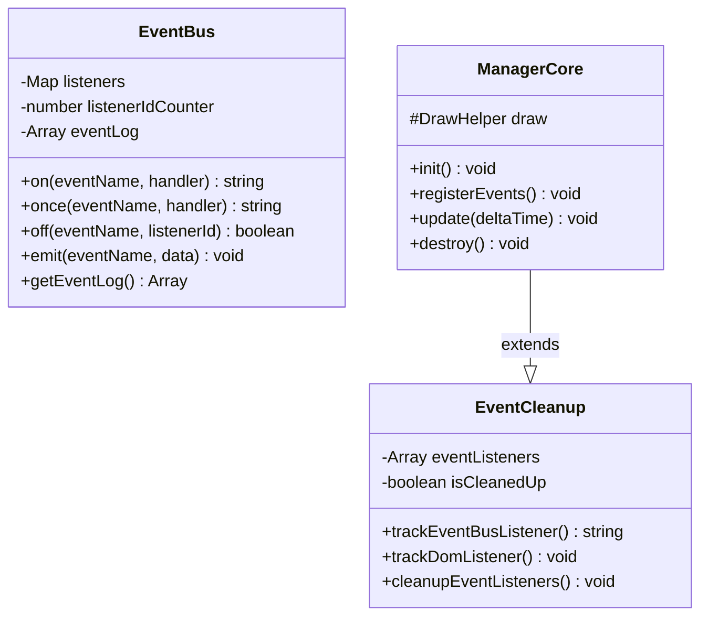
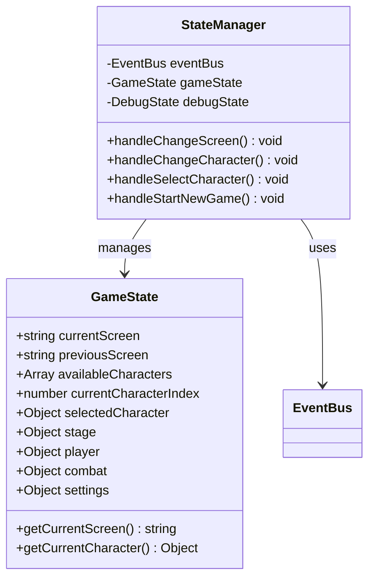
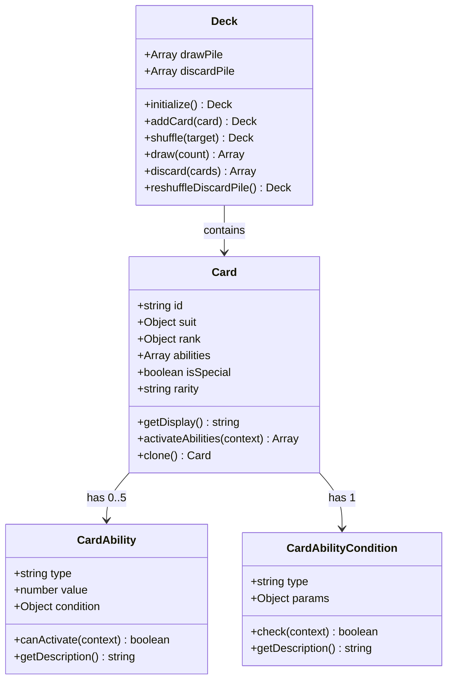
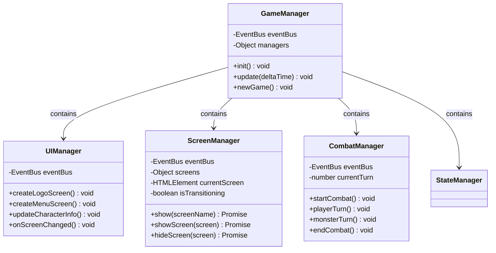
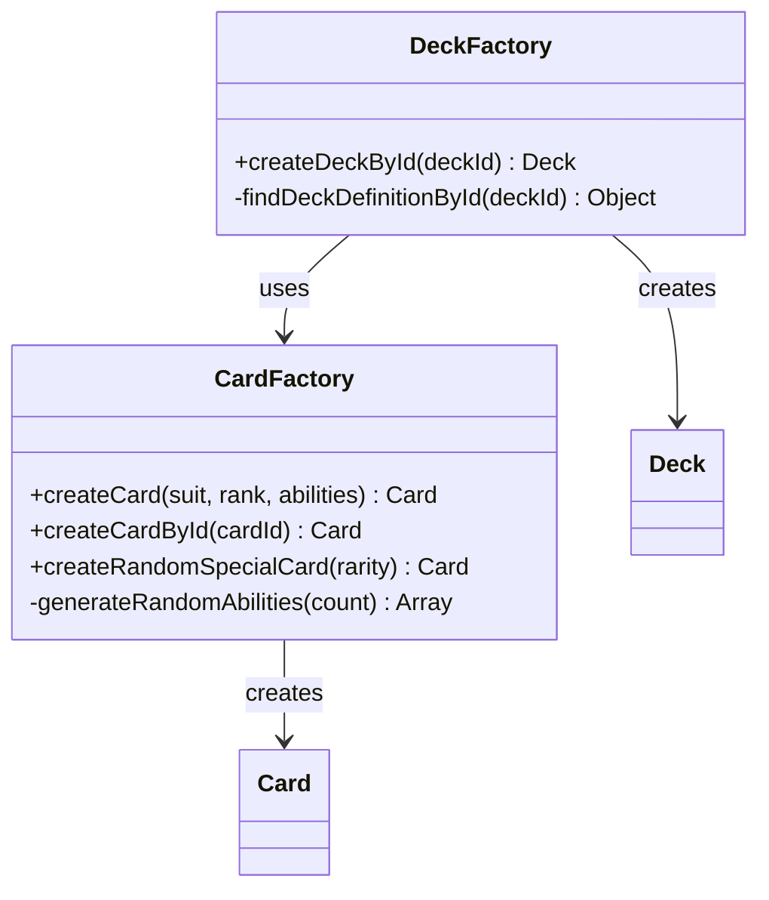
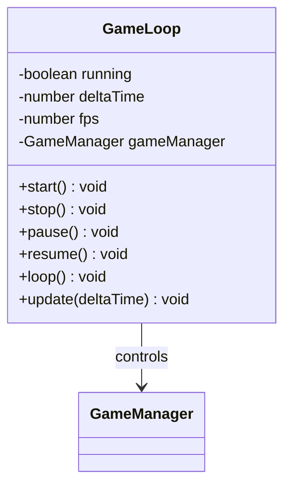
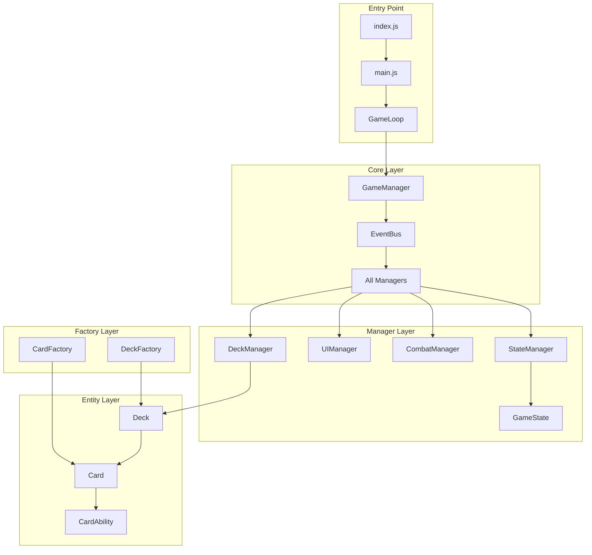

# 클래스 다이어그램

## Core 시스템

```mermaid
classDiagram
    class EventBus {
        -Map listeners
        -number listenerIdCounter
        -Array eventLog
        +on(eventName, handler) string
        +once(eventName, handler) string
        +off(eventName, listenerId) boolean
        +emit(eventName, data) void
        +getEventLog() Array
    }

    class ManagerCore {
        #DrawHelper draw
        +init() void
        +registerEvents() void
        +update(deltaTime) void
        +destroy() void
    }

    class EventCleanup {
        -Array eventListeners
        -boolean isCleanedUp
        +trackEventBusListener() string
        +trackDomListener() void
        +cleanupEventListeners() void
    }

    ManagerCore --|> EventCleanup : extends
```

## State 시스템

```mermaid
classDiagram
    class GameState {
        +string currentScreen
        +string previousScreen
        +Array availableCharacters
        +number currentCharacterIndex
        +Object selectedCharacter
        +Object stage
        +Object player
        +Object combat
        +Object settings
        +getCurrentScreen() string
        +getCurrentCharacter() Object
    }

    class StateManager {
        -EventBus eventBus
        -GameState gameState
        -DebugState debugState
        +handleChangeScreen() void
        +handleChangeCharacter() void
        +handleSelectCharacter() void
        +handleStartNewGame() void
    }

    StateManager --> GameState : manages
    StateManager --> EventBus : uses
```

## Entity 시스템

```mermaid
classDiagram
    class Card {
        +string id
        +Object suit
        +Object rank
        +Array abilities
        +boolean isSpecial
        +string rarity
        +getDisplay() string
        +activateAbilities(context) Array
        +clone() Card
    }

    class Deck {
        +Array drawPile
        +Array discardPile
        +initialize() Deck
        +addCard(card) Deck
        +shuffle(target) Deck
        +draw(count) Array
        +discard(cards) Array
        +reshuffleDiscardPile() Deck
    }

    class CardAbility {
        +string type
        +number value
        +Object condition
        +canActivate(context) boolean
        +getDescription() string
    }

    class CardAbilityCondition {
        +string type
        +Object params
        +check(context) boolean
        +getDescription() string
    }

    Card --> CardAbility : has 0..5
    Card --> CardAbilityCondition : has 1
    Deck --> Card : contains
```

## Manager 시스템

```mermaid
classDiagram
    class GameManager {
        -EventBus eventBus
        -Object managers
        +init() void
        +update(deltaTime) void
        +newGame() void
    }

    class UIManager {
        -EventBus eventBus
        +createLogoScreen() void
        +createMenuScreen() void
        +updateCharacterInfo() void
        +onScreenChanged() void
    }

    class ScreenManager {
        -EventBus eventBus
        -Object screens
        -HTMLElement currentScreen
        -boolean isTransitioning
        +show(screenName) Promise
        +showScreen(screen) Promise
        +hideScreen(screen) Promise
    }

    class CombatManager {
        -EventBus eventBus
        -number currentTurn
        +startCombat() void
        +playerTurn() void
        +monsterTurn() void
        +endCombat() void
    }

    GameManager --> UIManager : contains
    GameManager --> ScreenManager : contains
    GameManager --> CombatManager : contains
    GameManager --> StateManager : contains
```

## Factory 시스템

```mermaid
classDiagram
    class CardFactory {
        +createCard(suit, rank, abilities) Card
        +createCardById(cardId) Card
        +createRandomSpecialCard(rarity) Card
        -generateRandomAbilities(count) Array
    }

    class DeckFactory {
        +createDeckById(deckId) Deck
        -findDeckDefinitionById(deckId) Object
    }

    CardFactory --> Card : creates
    DeckFactory --> Deck : creates
    DeckFactory --> CardFactory : uses
```

## 게임 루프

```mermaid
classDiagram
    class GameLoop {
        -boolean running
        -number deltaTime
        -number fps
        -GameManager gameManager
        +start() void
        +stop() void
        +pause() void
        +resume() void
        +loop() void
        +update(deltaTime) void
    }

    GameLoop --> GameManager : controls
```

## 관계도 요약

```mermaid
graph TB
    subgraph "Entry Point"
        index[index.js] --> main[main.js]
        main --> GameLoop
    end

    subgraph "Core Layer"
        GameLoop --> GameManager
        GameManager --> EventBus
        EventBus --> Managers[All Managers]
    end

    subgraph "Manager Layer"
        Managers --> StateManager
        StateManager --> GameState
        Managers --> UIManager
        Managers --> CombatManager
        Managers --> DeckManager
    end

    subgraph "Entity Layer"
        DeckManager --> Deck
        Deck --> Card
        Card --> CardAbility
    end

    subgraph "Factory Layer"
        CardFactory --> Card
        DeckFactory --> Deck
    end
```
